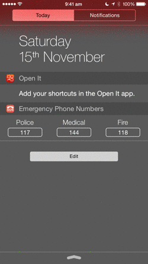

OpenIt
======

TL:DR: This is bad code. I wrote it a long time ago and never really improved it.

This was an app I started to develop just after attending WWDC 2014. I was super excited about the endless possibilities to create widgets and so I had this idea where you could add buttons to the notification center to launch other apps. The plan was to submit the app to the App Store but after seeing other launcher apps being rejected (or approved and then removed), I decided to open source the project. So here it is.
The app uses URL schemes to open other apps. I already added some Apple defaults URL scheme (with parameters too) but you can choose to create a custom action and write your own scheme.

I never fully tested the app so you could find some bugs here and there :)

Feel free to download the project and install it on your device or use the code as you prefer (but please don't try to submit the project on the App Store as it is). 
